# cep-devops-docker-lab

Docker Lab del curso de Introducción a DevOps. Este laboratorio tiene como objetivo practicar los conceptos básicos de
Docker:

- Imágenes
- Contenedores
- Capas
- Volúmenes
- Redes
- Docker Compose

---


# 📝 Task 1. Creando imágenes

## Paso 1

Ejecutamos un contenedor basado en la imagen `ubuntu`:

    docker run -it --name juanraubuntu ubuntu bash


<figure>
    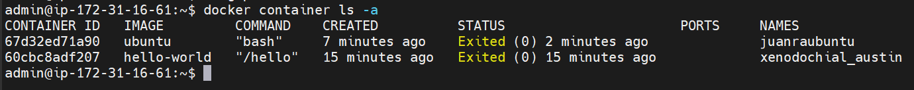
    <figcaption>Fig. Lista de contenedores</figcaption>
</figure>


Estamos creando y arrancando un contenedor interactivo con el sistema operativo Ubuntu:

- `docker run` crea e inicia un nuevo contenedor
- `-it` representa los flags `interactive`, que mantiene la entrada STDIN abierta para poder escribir comandos en el contenedor, y `tty`, que asigna una terminal virtual al contenedor, para que veamos la consola como en una máquina real
- `--name juanraubuntu` asigna un nombre personalizado al contenedor para poder identificarlo fácilmente.
- `ubuntu` especifica la imagen base que se va a utilizar 
- el último parámetro suele ser el comando que se ejecuta dentro del contenedor nada más iniciarlo, al poner `bash` estamos abriendo una terminal (shell) para empezar a escribir comandos de inmediato, lo que es necesario para poder ejecutar la siguiente acción.  

Accedemos a la terminal del contenedor e instalamos `curl`:

```bash
apt-get update
apt-get install curl
```

Y comprobamos que funciona:

```bash
curl --version
```

<figure>
    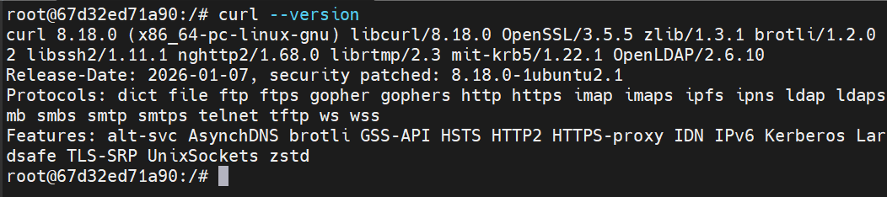
    <figcaption>Fig. <code>curl</code> instalado</figcaption>
</figure>

---

### ❓ Pregunta

¿Con qué comando podrías **guardar los cambios del contenedor como una
nueva imagen**?

Para esto debemos usar el comando `docker commit`. Si por ejemplo queremos nombrar a la nueva imagen como `mi-ubuntu-curl`

    docker commit -m "instalado curl" juanraubuntu mi-ubuntu-curl:v1

- `juanraubuntu` es el contenedor modificado a partir del cual creamos la nueva imagen
- el flag `-m` sirve (igual que en git) para documentar los cambios realizados; es opcional pero incluirlo se considera buenas prácticas
- `mi-ubuntu-curl` es el nombre que damos a la nueva imagen
- la etiqueta `:v1` sirve para controlar la versión y también es opcional; por defecto docker asigna la etiqueta `latest` 

<figure>
    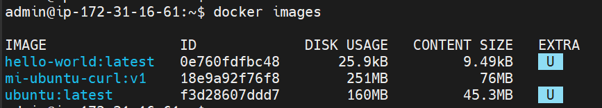
    <figcaption>Fig. Imágenes creadas o descargadas en el repositorio local</figcaption>
</figure>

---

## Paso 2 --- Dockerfile

Vamos a crear ahora un `Dockerfile` que haga lo mismo que hemos hecho en el **Paso 1** pero ahora automáticamente.

```dockerfile
FROM ubuntu:latest

RUN apt-get update && apt-get install -y curl

CMD ["bash"]
```

- `FROM ubuntu:latest` define la imagen base sobre la que vamos a construir. En este caso, la última versión oficial de Ubuntu.
- `RUN apt-get update && apt-get install -y curl` ejecuta los comandos de instalación durante la construcción de la imagen. Usamos `&&` para encadenar los comandos  y añadimos la bandera `-y` (yes) para que el proceso no se detenga cuando el gestor de paquetes solicite confirmación interactiva en la terminal.
- `CMD ["bash"]` indica el comando por defecto que se ejecutará automáticamente cada vez que alguien arranque un contenedor desde esta imagen.

Para construir la imagen a partir del archivo `Dockerfile` de configuración y guardarla en nuestro sistema utilizaremos el comando `docker build`:

    docker build -t mi-ubuntu-curl:v1 .

El último parámetro del comando es el contexto de construcción, que especifica la ubicación de los archivos que Docker va a usar durante el proceso. En nuestro caso hemos puesto . (punto) como contexto, así que sólo funcionará correctamente si ejecutamos el comando en el mismo directorio donde se encuentra el `Dockerfile`. 

<figure>
    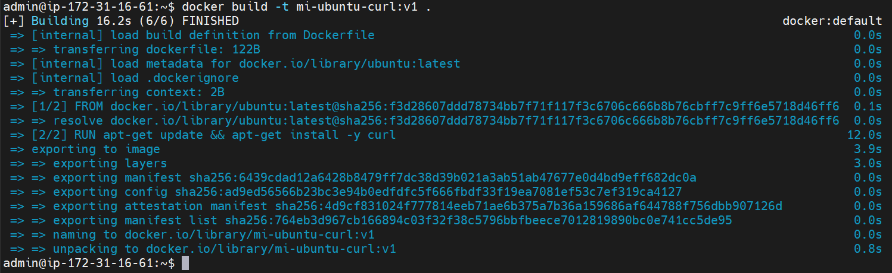
    <figcaption>Fig. Construcción de una imagen a partir de un Dockerfile</figcaption>
</figure>


Arrancamos el contenedor y comprobamos que `curl` está instalado:

    docker run -it --name new-juanraubuntu mi-ubuntu-curl:v1

<figure>
    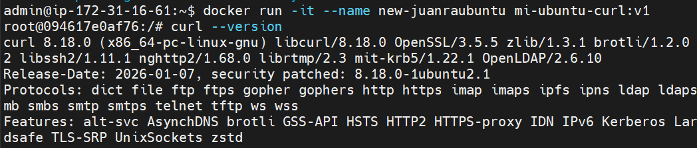
    <figcaption>Fig. curl en funcionamiento</figcaption>
</figure>

---

### ❓ Pregunta

¿Qué comando permite ver las **capas de una imagen Docker**?
Para ver las capas de una imagen Docker, el motor nos ofrece el comando `docker history`. Para ver las capas de la imagen que acabamos de crear deberemos ejecutar el comando:

    docker history mi-ubuntu-curl:v1

<figure>
    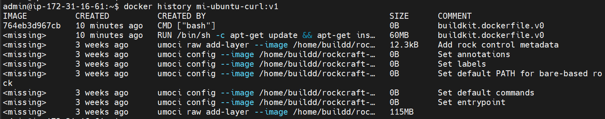
    <figcaption>Fig. Capas de datos de una imagen Docker</figcaption>
</figure>

---

# 📝 Task 2. Limpiando imágenes (opcional)

Crea un `Dockerfile` basado en:

    ubuntu

Construye la imagen.

Después modifica el Dockerfile para instalar:

- `curl`
- después `wget`

Construye la imagen en cada cambio.

Vamos a ver cómo se haría todo el proceso anterior paso a paso.

1. Creamos el archivo Dockerfile 

    ```dockerfile
    FROM ubuntu:latest
    ```

2. Construimos la primera versión de la imagen

        docker build -t mi-ejercicio2:v1 .

3. Modificamos el archivo Dockerfile para instalar curl

    ```dockerfile
    FROM ubuntu:latest
    RUN apt-get update && apt-get install -y curl
    ```

4. Construimos la segunda versión de la imagen

        docker build -t mi-ejercicio2:v2 .

5. Modificamos el archivo Dockerfile para instalar también wget

    ```dockerfile
    FROM ubuntu:latest
    RUN apt-get update && apt-get install -y curl wget
    ```

6. Construimos la tercera versión de la imagen

        docker build -t mi-ejercicio2:v3 .


Con `docker history mi-ejercicio2:v3` podemos ver todas las capas que forman la imagen.

<figure>
    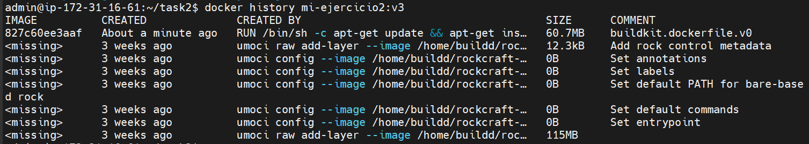
    <figcaption>Fig. Capas de datos de la imagen mi-ejercicio2:v3</figcaption>
</figure>

Y con `docker images` podemos ver cómo todas las imágenes creadas en el proceso se han ido añadiendo a nuestro repositorio

<figure>
    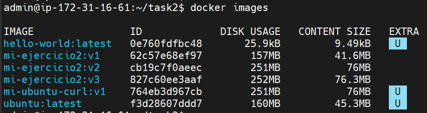
    <figcaption>Fig. Imágenes del repositorio local</figcaption>
</figure>


### ❓ Pregunta

¿Qué ocurre con las imágenes anteriores?

La pregunta es muy abierta, no tengo ni idea de a qué se refiere, así que voy a tirar por el lado de cómo Docker gestiona las imágenes y (por extensión) el espacio de disco. 

Como he utilizado distintas etiquetas en cada construcción (para diferenciar las versiones) Docker conserva todas las imágenes intactas en el disco local. Puede parecer un "derroche" de espacio pero no es del todo así. De hecho las versiones v2 y v3 se construyeron de forma casi instantánea porque cada una de ellas reutilizó las capas compartidas de la versión anterior, lo que optimiza el tiempo de descarga, pero también el espacio en disco.

Si eliminamos las versiones v1 y v2, la versión v3 no se ve afectada, pero curiosamente el espacio en disco tampoco. Esto es porque Docker gestiona las imágenes mediante un sistema de capas direccionables por contenido (content-addressable storage). Cada capa es un conjunto de archivos independiente identificado por un código único (hash). Si eliminamos una imagen, por ejemplo `mi-ejercicio2:v1`, Docker sólo borra un nombre, un ***'puntero'*** o referencia que apunta a las capas que lo forman, pero no elimina las capas mientras exista alguna imagen que las esté utilizando (en nuestro caso las v2 y v3). Las capas (archivos en disco) sólo se eliminan cuando se han eliminado todas las imágenes que las utilizan. 

Cada instrucción `RUN` de un `Dockerfile` genera una nueva capa, de ahí que se utilice `&&` para unificar comandos en una única ejecución. De este modo generamos una sola capa y podemos hacer que la imagen sea más eficiente y llegue a ocupar menos espacio de disco.

Para ver el espacio real que ocupan las capas e imágenes podemos utilizar el comando `docker system df`

<figure>
    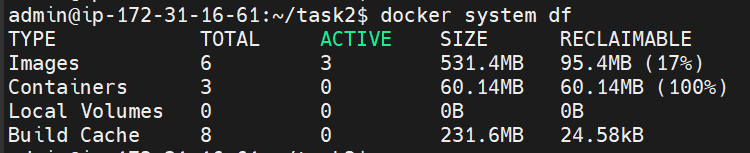
    <figcaption>Fig. Espacio en disco que ocupan imágenes y contenedores</figcaption>
</figure>

---

# 📝 Task 3. Volúmenes persistentes
Por defecto, los contenedores son "efímeros": si guardas un archivo dentro de ellos y el contenedor se elimina, ese archivo desaparece para siempre. Los volúmenes persistentes sirven para separar los datos importantes del ciclo de vida del contenedor. Al usarlos nos aseguramos de conservar los datos intactos aunque el contenedor se detenga, se actualice o se elimine. 

¿Para qué se usan principalmente?
- Bases de datos: Para conservar la información de la app aunque apaguemos o actualicemos el contenedor que ejecuta el motor de la base de datos.
- Archivos de los usuarios: Para almacenar imágenes, PDFs o vídeos que los clientes suben a tu aplicación web.
- Archivos de configuración: Para modificar la configuración de un servicio (como Nginx o Apache) sin tener que reconstruir la imagen de Docker cada vez.
- Compartir datos: Para permitir que dos o más contenedores diferentes accedan y modifiquen la misma carpeta de archivos de manera concurrente.

Docker ofrece dos formas de persistir los datos:
1. Volúmenes Docker (Gestionados directamente por el motor Docker). Docker crea y administra una carpeta oculta dentro de su propio sistema de archivos en el disco duro de la máquina host.

        Comando: docker run -d --name mi-contenedor -v nombre-volumen:/ruta/carpeta/contenedor imagen-docker:version

    Uso típico: Bases de datos en entornos de producción, ya que Docker optimiza el rendimiento de lectura y escritura.

2. Bind Mounts. Mapea de forma directa una carpeta del sistema de archivos local (Host) con una carpeta dentro del contenedor. 

        Comando: docker run -d --name mi-contenedor -v /ruta/carpeta/host:/ruta/carpeta/contenedor imagen-docker:version
    
    Uso típico: Desarrollo de software. El contenedor aporta toda la infraestructura necesaria para que la aplicación funcione y el volumen almacena el código fuente de la aplicación. Si modificamos el código de la app en un editor local, el contenedor verá el cambio de inmediato sin necesidad de reiniciarlo.

## Crear base de datos

Vamos a ver un ejemplo práctico, creando contenedor con un volumen Docker para una base de datos PostgreSQL 

```bash
docker run -d \
    --name postgres-task3 \
    -e POSTGRES_USER=juanra \
    -e POSTGRES_PASSWORD=juanra \
    -e POSTGRES_DB=databaseTask3 \
    -p 5432:5432 \
    -v databaseTask3:/var/lib/postgresql/data \
    postgres:17
```

## Crear tabla

Ahora nos conectamos a la base de datos

    docker exec -it postgres-task3 psql -U juanra -d databaseTask3

Creamos la tabla `items`:

```sql
CREATE TABLE items (
id SERIAL PRIMARY KEY,
name TEXT
);
```

Insertamos un registro:

```sql
INSERT INTO items(name) VALUES ('item1');
```

Y por útimo verificamos que los datos se han insertado en la BD.

```sql
SELECT * FROM items;
```

<figure>
    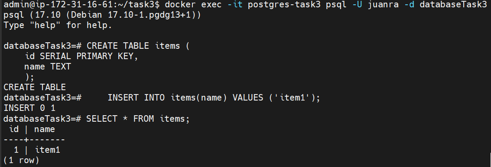
    <figcaption>Fig. Creación de la base de datos</figcaption>
</figure>

---

## Comprobación

1.  Paramos el contenedor

    docker stop postgres-task3

2.  Eliminamos el contenedor

    docker rm postgres-task3

3.  Creamos un nuevo contenedor usando **el mismo volumen**. Hay que tener en cuenta que la BD ya está creada físicamente, y persisten tanto sus datos como su configuración inicial (usuarios y credenciales).

    docker run -d \
        --name db-postgres-task3 \
        -e POSTGRES_USER=juanra \
        -e POSTGRES_PASSWORD=juanra \
        -e POSTGRES_DB=databaseTask3 \
        -p 5432:5432 \
        -v databaseTask3:/var/lib/postgresql/data \
        postgres:17

4. Nos conectamos a la base de datos

    docker exec -it db-postgres-task3 psql -U juanra -d databaseTask3

5. Comprobamos que los datos siguen existiendo.

    ```sql
    SELECT * FROM items;
    ```

<figure>
    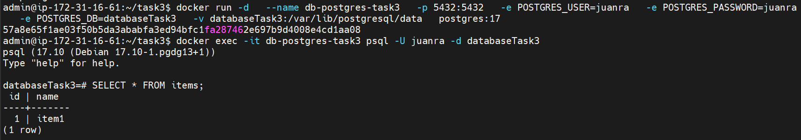
    <figcaption>Fig. Consulta a la base de datos</figcaption>
</figure>

---

# 📝 Task 4. Bind mounts

Vamos a ver ahora un ejemplo práctico del otro método de persistencia que nos ofrece Docker, mapeando una carpeta de la máquina host a una del contenedor.

Vamos a crear una web sencilla en la máquina host contenedor, con un único archivo index.html 

```html
<!DOCTYPE html>
<html lang="es">
<head>
    <meta charset="UTF-8">
    <title>Task 4</title>
    <style>
        body { font-family: system-ui, sans-serif; background: #f0f2f5; 
        display: flex; justify-content: center; align-items: center; 
        height: 100vh; margin: 0; }
        .card { background: white; margin: 20px; padding: 30px; border-radius: 12px; 
        box-shadow: 0 4px 15px rgba(0,0,0,0.1); text-align: center; max-width: 350px; }
        h1 { color: #1e293b; margin: 0 0 10px 0; font-size: 28px; }
        p { color: #64748b; font-size: 16px; line-height: 1.5; margin: 0; }
    </style>
</head>
<body>
    <div class="card">
        <h2>Entorno de Desarrollo</h2>
        <p>Infraestructura web montada en un contenedor Nginx. Permite ejecutar y probar la aplicación de forma aislada sin instalar servidores locales en el sistema host.</p>
    </div>
</body>
</html>
```
Ahora crearemos un contenedor `nginx` utilizando `Alpine`, una distro Linux muy ligera, para que funcione como servidor web. Mapeo el puerto 80 del contenedor al 80 de la máquina host (y no el 8080) porque estoy trabajando en una máquina remota creada en AWS. Montaremos el contenedor mapeando la carpeta del host con el código fuente con la carpeta `/usr/share/nginx/html` del contenedor.

```bash
docker run -d \
  --name web-task4 \
  -p 80:80 \
  -v "$(pwd)/task4:/usr/share/nginx/html:ro" \
  nginx:alpine
```


Nos conectamos con el navegador a la IP pública de la máquina AWS para ver la web.

<figure>
    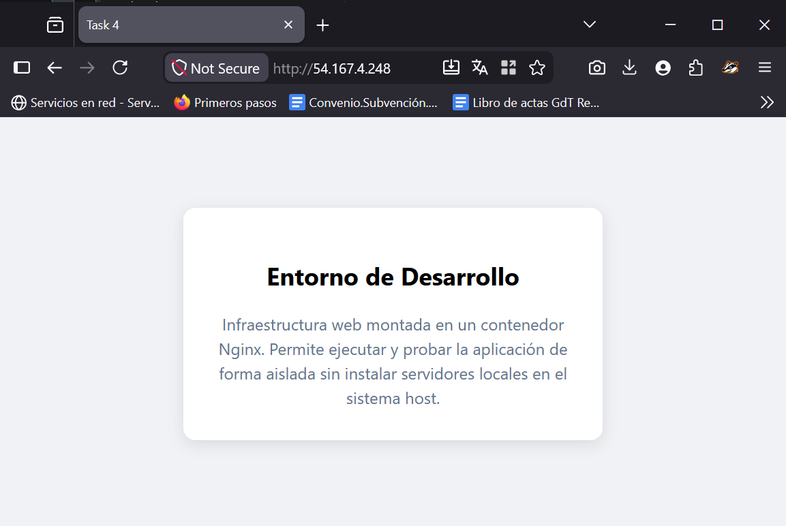
    <figcaption>Fig. Aspecto de la web</figcaption>
</figure>


### ❓ Pregunta

¿Qué ocurre si modificas el archivo `index.html` en tu máquina?

Modificamos `task4/index.html` añadiendo una segunda tarjeta

```html
    <div class="card">
        <h2>Sincronización en Tiempo Real</h2>
        <p>¡El Bind Mount funciona con éxito! Los cambios realizados en el archivo HTML local se actualizan de forma inmediata y automática en el contenedor sin reiniciar el servicio.</p>
    </div>
```

Recargamos la página en el navegador y vemos que se actualiza la página.

<figure>
    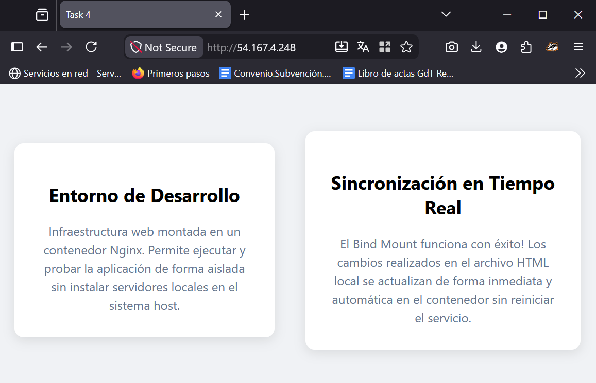
    <figcaption>Fig. Aspecto de la web tras modificar el archivo</figcaption>
</figure>


---

# 📝 Task 5. Auditando volúmenes (opcional)

### 🔍 Investiga

¿Qué comando permite ver **dónde guarda Docker los datos de un volumen**?

Para ver la ubicación exacta del disco duro de la máquina host donde Docker guarda físicamente los archivos de un volumen, hay que usar el comando

    docker volume inspect NOMBRE_DEL_VOLUMEN

Por ejemplo, vamos a inspeccionar el volumen que utilizamos en la tarea 3 para la base de datos 

    docker volume inspect databaseTask3

<figure>
    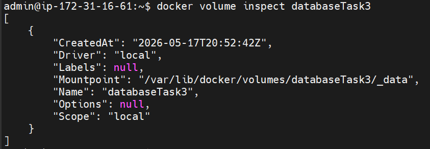
    <figcaption>Fig. Salida del comando volume inspect</figcaption>
</figure>

El campo `Mountpoint` es donde aparece la ruta hasta el archivo físico del volumen.

---

# 📝 Task 6. Creando redes privadas

En Docker, la gestión de redes define cómo se comunican los contenedores entre sí y con el mundo exterior. El motor de Docker clasifica las tecnologías de conectividad (**y aislamiento**) mediante cuatro controladores (drivers)

- bridge
- overlay
- host
- none

los cuales se aplican en dos momentos diferentes: ***al crear una red o al arrancar un contenedor***. 

### Crear redes

Para crear redes en Docker se utiliza el comando 

    docker network create --driver <tipo> NOMBRE-DE-RED

El ***Controlador*** (Driver) es la tecnología o el mecanismo de aislamiento, es decir, el código de Docker que define las reglas básicas de conectividad que aplicamos a una determinada red. Los controladores nativos son `bridge`, `host`, `none` y `overlay`. Mientras que una ***Red*** vendría a ser una instancia de alguno de esos controladores a la que *enchufamos* el contenedor.

Cuando los usuarios necesitamos crear redes personalizadas para interconectar nuestros contenedores con `docker network create`, podemos utilizar sólo dos de esos controladores:

+ bridge (puente): Es el controlador por defecto (el que Docker utilizará si no especificamos ninguno). Crea una red privada y virtual dentro de la máquina host. Todos los contenedores asignados a esta red pueden comunicarse entre sí y tienen salida hacia el exterior de forma automática. Sin embargo, el tráfico entrante desde el exterior está bloqueado por defecto, a menos que expongamos puertos específicos del contenedor hacia la máquina host al arrancarlo (`-p puerto_host:puerto_contenedor`).
    + Ventaja clave: Las redes bridge creadas por el usuario incluyen de manera automática un servidor DNS interno. Así que los contenedores pueden comunicarse usando sus nombres (ej. db-postgres) sin necesidad de conocer sus IPs internas
+ overlay (superposición): Se utiliza para crear redes distribuidas que abarcan múltiples máquinas host independientes. Permite la comunicación segura entre contenedores alojados en servidores físicos distintos y es el pilar fundamental al trabajar con orquestadores en clúster (como Docker Swarm o Kubernetes).

### Redes por defecto

Docker implementa **tres Redes Predefinidas** nativas denominadas `host`, `none` y `bridge` creadas a partir de los controladores homónimos. 

Son redes físicas virtuales creadas por el motor Docker en el momento de su instalación en la máquina host, a las cuales podemos conectar nuestros contenedores.

+ ***host*** : El controlador `host` elimina por completo el aislamiento de red entre el contenedor y la máquina host, por lo que los contenedores conectados a esta red se adueñan de la interfaz física, la IP y los puertos de la máquina real.
    + Rendimiento : Ofrece la máxima velocidad posible al eliminar el puente virtual
    + Conflictos : Requiere extremo cuidado. Todos los contenedores asumen la misma IP, por lo que si un contenedor intenta usar un puerto (ej. el 80) que ya está ocupado por un servicio de la máquina host o de otro contenedor de la red, su arranque fallará inmediatamente con el error `*bind: Address already in use*`.
    + Utilidad : Aplicaciones de alto rendimiento (Big Data, Streaming, etc.), herramientas de monitorización de red y análisis de tráfico real (Prometheus, Grafana, Wireshark, etc.)
+ ***none*** : El controlador `none` elimina todos los interfaces de red del contenedor excepto el del loopback. Por ello los contenedores conectados a esta red, por contradictorio que pueda parecer, se ejecutan en aislamiento absoluto: carecen de dirección IP, no ven a otros contenedores y no tienen acceso a internet.
    + Utilidad : Procesamiento de datos locales altamente confidenciales, generación de claves criptográficas o análisis de archivos sospechosos (Sandboxing).

<figure>
    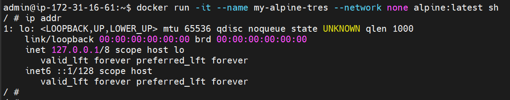
    <figcaption>Fig. Interfaces de red de un contenedor de la red 'none'</figcaption>
</figure>

+ ***bridge*** : Es la red por defecto a la que Docker conecta un contenedor cuando no especificamos red o modo de conectividad alguno al iniciarlo. Su comportamiento es casi idéntico al de una red de usuario creada con el flag `--driver bridge`; la única diferencia es que la red predefinida de Docker no tiene resolución de nombres por DNS. Si conectas dos contenedores a ella, no podrán comunicarse usando sus nombres; sólo pueden comunicarse mediante sus direcciones IP internas, las cuales pueden cambiar cada vez que reinicias el contenedor.

### Gestionar las redes

Docker nos ofrece distintos comandos para la gestión de las redes creadas por el usuario, similares a los que utilizamos para la gestión de los contenedores:
- Listar redes disponibles = `docker network ls`
- Ver máquinas (y sus IPs) dentro de la red = `docker network inspect NOMBRE-RED`
- Eliminar redes (solo funciona si no tiene contenedores activos) = `docker network rm NOMBRE-RED`

Para conectar un contenedor a una red utilizamos el flag `network` en el momento de su creación

    docker run --network <nombre_red> NOMBRE-IMAGEN
 
## Ejemplo de red

Vamos a crear la red `my-net`, conectar a ella dos contenedores `alpine` y comprobar que tenemos conectividad entre éstos. Utilizo `alpine` en lugar de `ubuntu` porque alpine es mucho más ligera y ya trae el comando ping instalado, mientras que en `ubuntu` tendría que instalarlo.

1. Creamos la red

    docker network create my-net

<figure>
    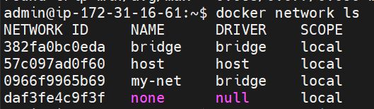
    <figcaption>Fig. Listado de redes activas (my-net y las redes predefinidas)</figcaption>
</figure>


2. Creamos el primer contenedor, lo conectamos a la red y lo lanzamos con un temporizador que lo mantenga activo por 10 minutos (tiempo suficiente para hacer nuestras pruebas)

    docker run -d --name mi-alpine-uno --network my-net alpine:latest sleep 600

3. Creamos el segundo contenedor, lo conectamos a la red y lo lanzamos directamente con el ping

    docker run -it --name my-alpine-dos --network my-net alpine:latest ping mi-alpine-uno

<figure>
    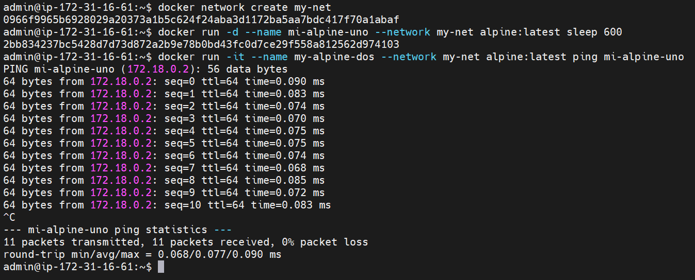
    <figcaption>Fig. Conectividad entre los contenedores de la red my-net</figcaption>
</figure>

---

### ❓ Pregunta

¿Los contenedores pueden comunicarse entre sí?

La anterior imagen nos muestra cómo el contenedor `mi-alpine-uno` responde al ping de `my-alpine-dos`, por lo que la respuesta es sí, pueden comunicarse.

Si inspeccionamos la red `my-net` podemos ver los dos contenedores conectados a ella y sus IPs

```json
    {
        "Name": "my-net",
        "Id": "0966f9965b6928029a20373a1b5c624f24aba3d1172ba5aa7bdc417f70a1abaf",
        "Created": "2026-05-18T11:37:35.705552653Z",
        "Scope": "local",
        "Driver": "bridge",
        "EnableIPv4": true,
        "EnableIPv6": false,
        "IPAM": {
            "Driver": "default",
            "Options": {},
            "Config": [
                {
                    "Subnet": "172.18.0.0/16",
                    "Gateway": "172.18.0.1"
                }
            ]
        },
        "Internal": false,
        "Attachable": false,
        "Ingress": false,
        "ConfigFrom": {
            "Network": ""
        },
        "ConfigOnly": false,
        "Options": {},
        "Labels": {},
        "Containers": {
            "2bb834237bc5428d7d73d872a2b9e78b0bd43fc0d7ce29f558a812562d974103": {
                "Name": "mi-alpine-uno",
                "EndpointID": "a5aa4b1a49d6d0f7121cf4f4f1e5e32ece07a4915fb809191047bb055ef8a785",
                "MacAddress": "0e:bd:73:84:7c:0b",
                "IPv4Address": "172.18.0.2/16",
                "IPv6Address": ""
            },
            "f37171096e88fa1e1c8c9cfd73cd090506033b39cc7205713acf981573af5f9e": {
                "Name": "my-alpine-dos",
                "EndpointID": "912a537f29f2df5f0a91fb97f715b0439e7194dbb00b35bf04f05d3a9d7a93d3",
                "MacAddress": "b6:0b:0a:70:d7:36",
                "IPv4Address": "172.18.0.3/16",
                "IPv6Address": ""
            }
        },
        "Status": {
            "IPAM": {
                "Subnets": {
                    "172.18.0.0/16": {
                        "IPsInUse": 5,
                        "DynamicIPsAvailable": 65531
                    }
                }
            }
        }
    }
```

---

# 📝 Task 7. Red `none` (opcional)

### 🔍 Investiga:

¿Para qué serviría ejecutar un contenedor con red `none`  ?

Tal y como se ha explicado en la tarea 6, los contenedores conectados a la red `none`, por contradictorio que pueda parecer, se ejecutan en aislamiento absoluto: carecen de dirección IP, no ven a otros contenedores y no tienen acceso a internet; por ello los contenedores conectados a `none` suele utilizarse para tareas como el procesamiento local de datos altamente confidenciales, la generación de claves criptográficas o el análisis de archivos sospechosos (Sandboxing).

---

# 📝 Task 8. Multi-network (opcional)

Docker nos ofrece la posibilidad de conectar un mismo contenedor a varias redes diferentes, pero no podemos hacerlo en un único comando `docker run`. Con ese comando podremos conectar el contenedor a una red, pero para conectarlo a las demas necesitaremos el comando

    docker network connect NUEVA-RED NOMBRE-CONTENEDOR

Otra forma de hacerlo es utilizando **Docker Compose**. Docker Compose es una herramienta de orquestación local que simplifica y automatiza el despliegue, configuración y gestión de servicios, redes y volúmenes de cualquier arquitectura de contenedores mediante archivos de configuración YAML. Permite replicar entornos idénticos con un único comando, eliminando la necesidad de escribir comandos `docker run` infinitos. 

## Ejemplo

Vamos a crear dos redes, `secure-zone`y `public-zone`, y a conectar un mismo contenedor a ambas.

1. Creamos las redes

    docker network create secure-zone
    docker network create public-zone

<figure>
    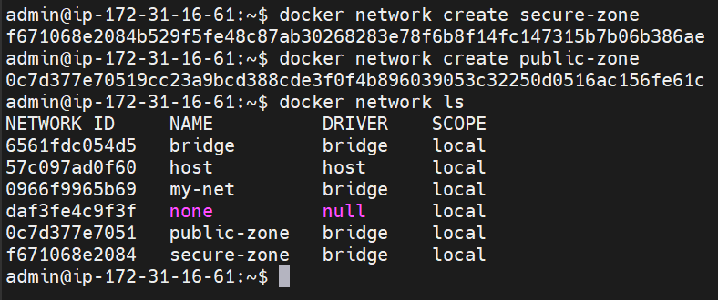
    <figcaption>Fig. Redes disponibles en nuestro sistema Docker</figcaption>
</figure>


2. Conectamos el contenedor. Vamos a utilizar el contenedor `my-alpine-tres` que ya está creado, pero como está conectado a la red `none` antes debemos desconectarlo de ella.

        docker network disconnect none my-alpine-tres
        docker network connect public-zone my-alpine-tres
        docker network connect secure-zone my-alpine-tres

3. Comprobamos

        docker start my-alpine-tres
        docker inspect my-alpine-tres

Arrancamos el contenedor con `docker start` e inspeccionamos el contenedor, para ver si recibe correctamente IP de todas las redes. A continuación se muestra la sección `NetworkSettings` del JSON que nos devuelve el comando `docker inspect` con el estado y configuración del contenedor `my-alpine-tres`. Podemos observar que el contenedor está conectado a las redes `public-zone` y `secure-zone`, y ha recibido IP de ambas. 

```json
        "NetworkSettings": {
            "SandboxID": "5659c09420ceecf096b16a55fa78112ebc58b4108d72c47be0222ccd7ff7a356",
            "SandboxKey": "/var/run/docker/netns/5659c09420ce",
            "Ports": {},
            "Networks": {
                "public-zone": {
                    "IPAMConfig": {},
                    "Links": null,
                    "Aliases": [],
                    "DriverOpts": {},
                    "GwPriority": 0,
                    "NetworkID": "0c7d377e70519cc23a9bcd388cde3f0f4b896039053c32250d0516ac156fe61c",
                    "EndpointID": "46fc2429cd06e26714f143a695bae6a466b2535ef8ba8aa5c14b1afb6fa83501",
                    "Gateway": "172.20.0.1",
                    "IPAddress": "172.20.0.2",
                    "MacAddress": "7a:8a:35:ea:ee:03",
                    "IPPrefixLen": 16,
                    "IPv6Gateway": "",
                    "GlobalIPv6Address": "",
                    "GlobalIPv6PrefixLen": 0,
                    "DNSNames": [
                        "my-alpine-tres",
                        "c82ad37f9df0"
                    ]
                },
                "secure-zone": {
                    "IPAMConfig": {},
                    "Links": null,
                    "Aliases": [],
                    "DriverOpts": {},
                    "GwPriority": 0,
                    "NetworkID": "f671068e2084b529f5fe48c87ab30268283e78f6b8f14fc147315b7b06b386ae",
                    "EndpointID": "e4d738359e4bf9a4ab3ae61999e586fd1acca2dcf899021b3cca4faa086a6982",
                    "Gateway": "172.19.0.1",
                    "IPAddress": "172.19.0.2",
                    "MacAddress": "9e:40:46:7e:79:c0",
                    "IPPrefixLen": 16,
                    "IPv6Gateway": "",
                    "GlobalIPv6Address": "",
                    "GlobalIPv6PrefixLen": 0,
                    "DNSNames": [
                        "my-alpine-tres",
                        "c82ad37f9df0"
                    ]
                }
            }
        },
```


---

# 📝 Task 9. Docker Compose -- Compartiendo volúmenes

Crea un fichero:

    docker-compose.yml

Con dos servicios.

### writer

Debe:

- montar un volumen en `/app/logs`
- escribir un timestamp cada 30 segundos

### reader

Debe:

- montar el volumen en modo solo lectura
- mostrar el contenido en consola

## Solución

```yaml
volumes:
  shared-logs: # Definimos el volumen compartido por ambos servicios

services:
  writer:
    image: alpine
    container_name: logs-writer
    volumes:
      - shared-logs:/app/logs # Montamos el volumen en la ruta solicitada
    command: >
      sh -c "while true; do 
        date  >> /app/logs/timestamp.log; 
        sleep 30; 
      done"
    # Comando que escribe un timestamp cada 30 segundos en un archivo dentro del volumen

  reader:
    image: alpine
    container_name: logs-reader
    volumes:
      - shared-logs:/app/logs:ro # Montamos el volumen en modo Sólo Lectura (':ro', Read-Only)
    command: >
      sh -c "tail -f /app/logs/timestamp.log"
    # Comando que lee y muestra en tiempo real los cambios del archivo      
```


<figure>
    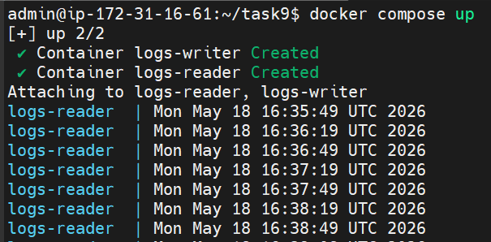
    <figcaption>Fig. Despliegue y ejecución de la aplicacion reader/writer</figcaption>
</figure>

---

# 📝 Task 10. Docker Compose Profiles (opcional)

Crea un `docker-compose.yml` con:

- `postgres`
- `pgadmin`

Haz que `pgadmin` pueda conectarse a `postgres`.

---

Crea dos perfiles:

### Perfil completo

Levanta:

- postgres
- pgadmin

### Perfil base

Levanta solo:

- postgres

## Solución

Los perfiles (*profiles*) son etiquetas en Docker Compose que permiten agrupar servicios para decidir cuáles se inician y cuáles no al ejecutar el comando `docker compose up`. Esto facilita el arranque selectivo de partes de nuestra aplicación según el contexto, lo que ayuda a gestionar entornos de desarrollo o producción específicos sin necesidad de duplicar archivos .yml.

El archivo `docker-compose.yml` que pide el ejercicio sería el siguiente

```yaml
services:
  postgres:
    image: postgres:17
    container_name: db-postgres
    profiles:
      - base
      - completo
    environment:
      POSTGRES_USER: mi_usuario
      POSTGRES_PASSWORD: mi_password
      POSTGRES_DB: mi_base_datos
    ports:
      - "5432:5432"

  pgadmin:
    image: dpage/pgadmin4
    container_name: web-pgadmin
    profiles:
      - completo
    environment:
      PGADMIN_DEFAULT_EMAIL: admin@correo.com
      PGADMIN_DEFAULT_PASSWORD: admin_password
    ports:
      - "80:80"
    depends_on:
      - postgres
```

Para comprobar que los perfiles funcionan vamos a ejecutar el perfil `base` 

    docker compose --profile base up -d

Ahora veamos si se ha ejecutado correctamente

    docker compose ps

<figure>
    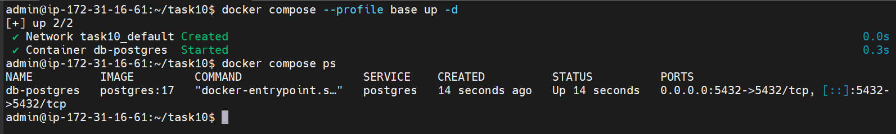
    <figcaption>Fig. Despliegue y ejecución del perfil base</figcaption>
</figure>

La captura muestra que sólo se ha iniciado el contenedor `postgres`, como era de esperar.

Antes de desplegar el otro perfil necesitamos desactivar el que ya hemos lanzado

<figure>
    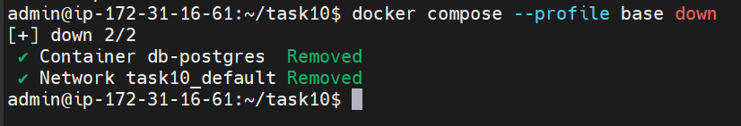
    <figcaption>Fig. Desactivación del perfil 'base'</figcaption>
</figure>

Por último, lanzamos el perfil `completo` 

    docker compose --profile completo up -d

Y comprobamos si se ha ejecutado correctamente

    docker compose ps


<figure>
    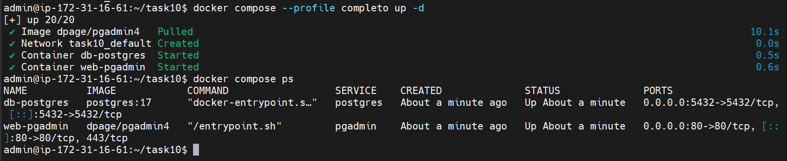
    <figcaption>Fig. Despliegue y ejecución de la aplicacion reader/writer</figcaption>
</figure>

La captura muestra que se han iniciado ambos contenedores, como era de esperar.


---
